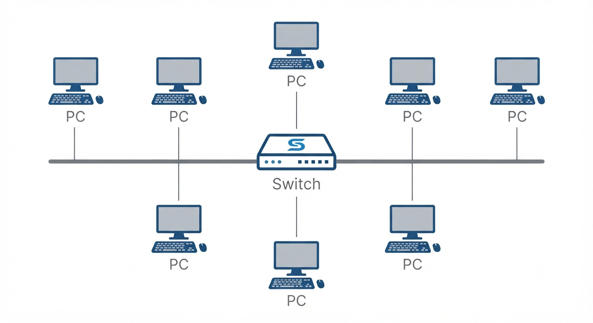
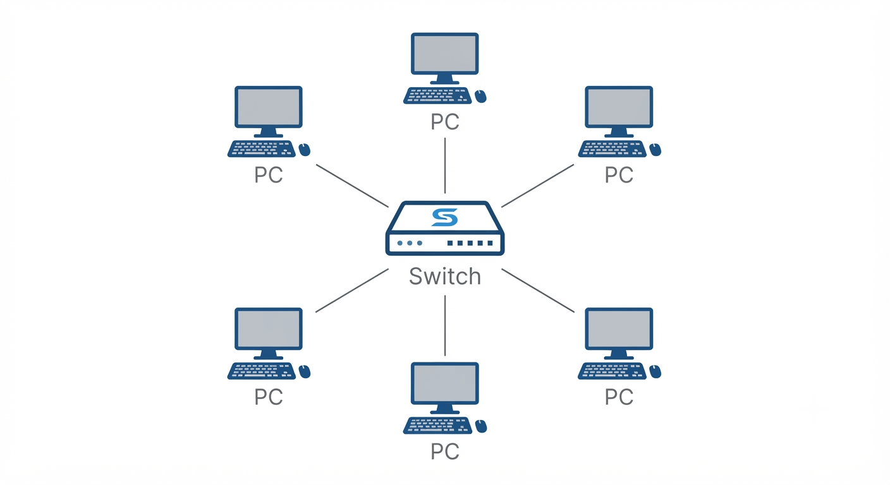
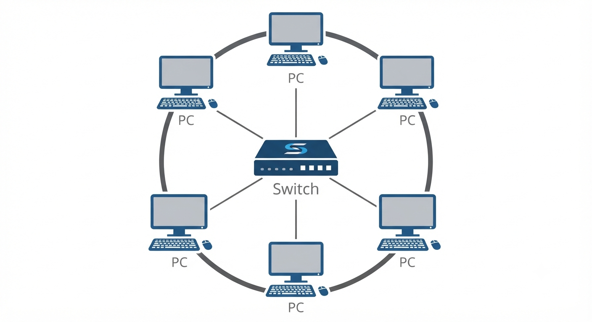
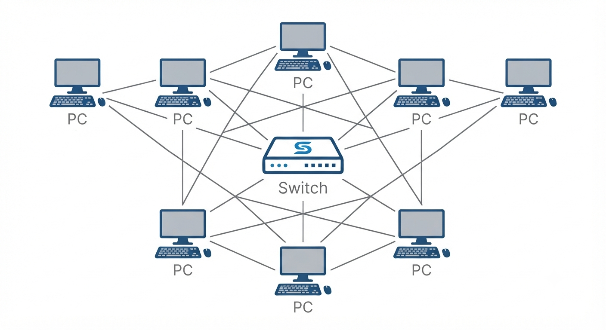
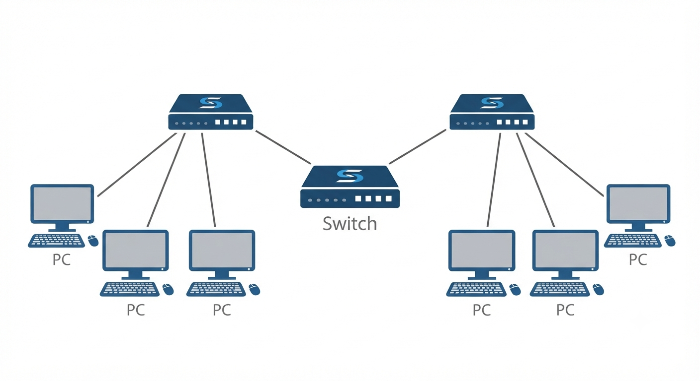
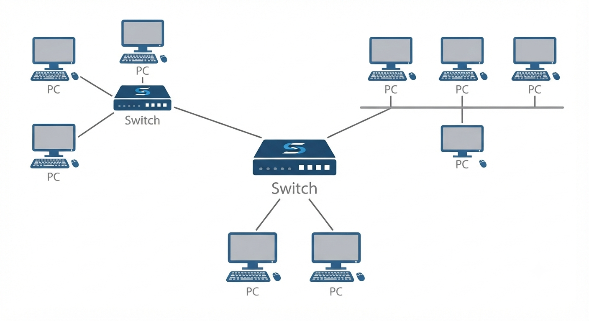
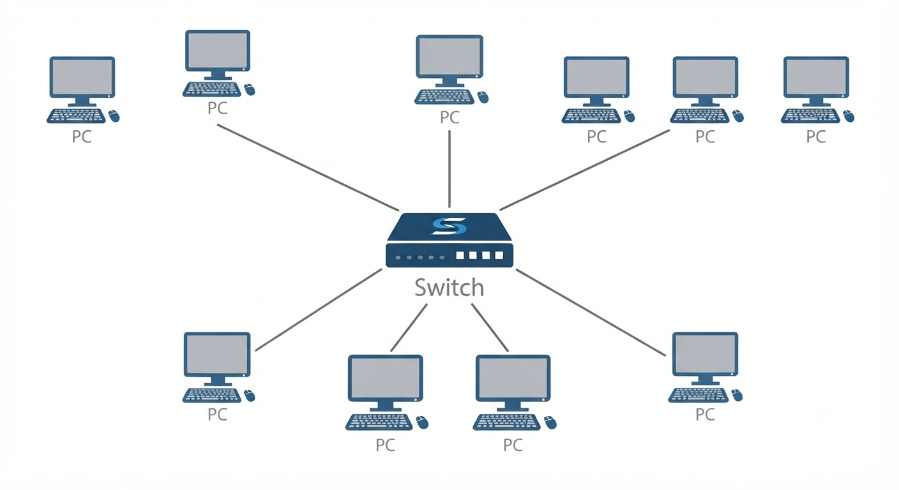

## What is Network Topology?

Network topology refers to the physical or logical arrangement of devices (nodes) and the connections (links) between them in a computer network.

# It determines:
-How devices are connected
-How data travels
-How easily the network can be expanded
-Performance
-Reliability
-Fault tolerance

## Why is Network Topology Important?

Network Speed
Scalability
Maintenance
Cost
Security
Fault Tolerance
Troubleshooting

## Components of a Network Topology

Nodes (PCs, Servers, Routers)
Switches
Hubs
Routers
Network Cables
Wireless Access Points
Network Links

## Bus Topology
All Devices are connected to a single central cable. simple and cost-eefective but hard to troubleshoot.
## Working
One device sends data.
Data travels across the backbone.
Every device receives it.
Only the destination accepts it.

# Advantages
Low cost
Easy installation
Less cable required
Good for small networks
# Disadvantages
Backbone failure brings down the entire network
Difficult troubleshooting
Low performance with many devices
Data collisions

## Bus Topology

# Star Topology
All Devices are connected to a central hub.If one link fails, Other remain unaffected.
# Working
Device sends data to Switch.
Switch forwards it only to the destination.
# Advantages
Easy troubleshooting
Fast communication
Easy to expand
One cable failure affects only one device
# Disadvantages
Switch failure stops the entire network
More cable required
Higher cost

## Star Topology

# Ring Topology
Devices are connected in a circular loop. Data travels in one direction.

# Working
Data travels in one direction (or both in Dual Ring).
Each device forwards data to the next device.

# Advantages
No collisions
Equal access
Predictable performance
# Disadvantages
One cable break affects communication
Difficult maintenance
Slow expansion

## Ring Topology

# Mesh Topology
Every devices is connected to every other devices provides high redundancy and reliability.

# Advantages
Very reliable
No single point of failure
High security
Excellent redundancy
# Disadvantages
Very expensive
Too many cables
Complex installation

## Mesh Topology

# Tree Topology
Tree topology combines multiple Star Topologies connected to a backbone.

# Advantages
Highly scalable
Easy expansion
Structured design
Easy management
# Disadvantages
Backbone failure affects many devices
Expensive
Complex setup

## Tree Topology

# Hybrid Topology
Combination of two or more different topologies.

Example:
Star + Bus
Star + Ring
Star + Mesh

# Advantages
Flexible
Scalable
Reliable
Better performance
# Disadvantages
Costly
Complex
Difficult management

## Hybrid Topology

# Point-to-Point Topology
A direct connection between two devices.

# Advantages
Fast
Secure
Simple
Dedicated bandwidth
# Disadvantages
Limited scalability
Only connects two devices

## Advantages of Good Network Topology
Better Performance
Faster Communication
Easier Troubleshooting
Higher Reliability
Better Security
Easy Expansion
Reduced Downtime

## Point-to-Point Topology

## Summary
Network topology defines how devices are connected and communicate.
Common types include Bus, Star, Ring, Mesh, Tree, Hybrid, and Point-to-Point.
Star Topology is the most widely used for LANs due to its simplicity and ease of maintenance.
Mesh Topology offers the highest reliability but comes with greater cost and complexity.
Tree and Hybrid Topologies are preferred in large enterprise environments because they provide scalability and flexibility.
Selecting the right topology depends on factors such as budget, network size, performance, reliability, and future growth requirements.