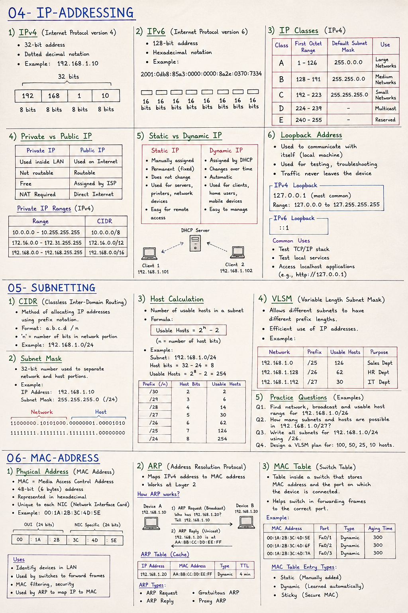

# What is an IP Address?
An IP (Internet Protocol) address is a unique numerical label assigned to each device connected to a network.

# Purpose
Identifies a device

Helps devices communication

# Types of IP Address

# IPv4-( internet protocol version 4)
It is 32-bit address, written in four decimal numbers.

# Example
192.168.10.1

# IPv6-( internet protocol version 6)
It is a 128-bit address written in hexadecimal. created to replace IPv4 due to address shortage.

# Example
fe90::8567:3221:a70:9076

## Private IPv4 Address Ranges

| Class | Private IP Range | CIDR Notation | Number of Addresses |
|:-----:|------------------|:-------------:|--------------------:|
| **A** | `10.0.0.0` – `10.255.255.255` | `/8` | 16,777,216 |
| **B** | `172.16.0.0` – `172.31.255.255` | `/12` | 1,048,576 |
| **C** | `192.168.0.0` – `192.168.255.255` | `/16` | 65,536 |

## Private IP vs Public IP

| Feature     | Private IP | Public IP |
|:--------    |:-----------|:----------|
| **Usage**   | Used inside Local Area Networks (LAN) | Used on the Internet 
| **Routability** | Not routable on the public Internet | Routable across the Internet |
| **Assignment** | Assigned by the local router or network administrator | Assigned by an Internet Service Provider (ISP) |
| **Cost** | Free to use | Usually provided by the ISP |
| **NAT Requirement** | Requires NAT to access the Internet | Can communicate directly over the Internet |
| **Uniqueness** | Can be reused in different private networks | Must be globally unique |
| **Security** | More secure as it is not directly accessible from the Internet | Less secure because it is publicly accessible |
| **Examples** | 192.168.1.10, 10.0.0.5 | 8.8.8.8, 142.250.183.110 |

# Static IP Address

A Static IP Address is a fixed IP address that is manually assigned to a device or permanently reserved by a DHCP server. It remains the same unless it is manually changed.

# Characteristics
Permanently assigned

Does not change automatically

Ideal for servers, printers, and network devices

Easier for remote access and hosting services

# Example
192.168.1.100

# Dynamic IP Address

A Dynamic IP Address is an IP address that is automatically assigned to a device by a DHCP (Dynamic Host Configuration Protocol) server. The address may change whenever the device reconnects to the network or when the DHCP lease expires.

# Characteristics
Automatically assigned by DHCP

Can change over time

Easy to manage

Commonly used for home users and office workstations

# Example
192.168.1.105 (Today)

192.168.1.112 (Tomorrow)

# What is a Loopback Address?

A Loopback Address is a special IP address used by a device to communicate with itself. It is primarily used to test the TCP/IP network stack and verify that the networking software is functioning correctly without sending traffic to an external network.

When data is sent to a loopback address, it never leaves the device. Instead, the operating system routes the traffic internally.

# IPv4 Loopback Address
127.0.0.1

# The entire range:
127.0.0.0/8

However, 127.0.0.1 is the most commonly used loopback address.

# What is Subnetting?

Subnetting is the process of dividing a large IP network into smaller, more manageable networks called subnets. It improves network performance, enhances security, reduces broadcast traffic, and makes efficient use of IP addresses.

# Benefits
Reduces network congestion

Improves security

Better IP address utilization

Simplifies network management

Limits broadcast domains

# CIDR (Classless Inter-Domain Routing)
# What is CIDR?

CIDR (Classless Inter-Domain Routing) is a method of allocating IP addresses and routing IP packets without relying on traditional IP address classes (A, B, and C). It uses a prefix length (e.g., /24) to specify how many bits belong to the network portion of an IP address.

# Examples
192.168.1.0/24

10.0.0.0/8

172.16.0.0/16

# What is a Subnet Mask?

A Subnet Mask is a 32-bit number used with an IPv4 address to separate into network and host part.

# Example
| ** IP Address **  | 192.168.1.10
|** Subnet Mask**   |  255.255.255.0
| ** CIDR **        |  /24

# What is Host Calculation?

Host Calculation is the process of determining how many valid host IP addresses are available within a subnet.

# Formula
Usable Hosts = 2^(Host Bits) - 2

The two reserved addresses are:

Network Address

Broadcast Address

# Example
Subnet: /24

Host Bits = 8

Usable Hosts = 2⁸ - 2 = 254

# VLSM (Variable Length Subnet Mask)
Variable Length Subnet Mask (VLSM) is a subnetting technique that allows different subnets within the same network to use different subnet mask lengths based on their host requirements. This improves IP address utilization by avoiding wasted addresses.

# Example
192.168.1.0/25   → 126 Hosts

192.168.1.128/26 → 62 Hosts

192.168.1.192/27 → 30 Hosts

# What is a Physical Address?
A Physical Address, also known as a MAC (Media Access Control) Address, is a unique 48-bit (6-byte) hardware identifier assigned to a Network Interface Card (NIC) by the manufacturer. It is used to identify devices within a Local Area Network (LAN) and operates at the Data Link Layer (Layer 2) of the OSI Model.

Unlike an IP address, which can change, a MAC address is typically permanent and uniquely identifies a network interface.

# Example
00:1A:2B:3C:4D:5E

# Characteristics
48-bit (6 bytes) long

Written in hexadecimal format

Assigned by the manufacturer

Unique for each network interface

Used only within the local network (LAN)

Operates at OSI Layer 2 (Data Link Layer)

# Uses of MAC Address
Identifies devices on a LAN

Enables communication between devices on the same network

Used by switches to forward Ethernet frames

Supports MAC filtering for basic network security

Used by the ARP protocol to map IP addresses to MAC addresses

# ARP (Address Resolution Protocol)
Address Resolution Protocol (ARP) is a network protocol used to map an IPv4 address to its corresponding MAC (Physical) Address within a Local Area Network (LAN).

When a device knows the destination IP address but not the destination MAC address, it sends an ARP Request. The device with the matching IP address responds with an ARP Reply containing its MAC address.

