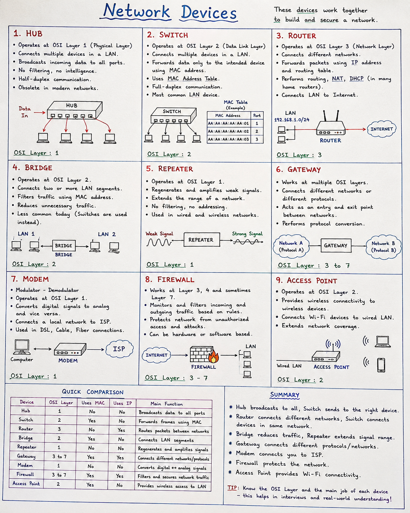

# What are Network Devices?

Network devices are hardware components that connect computers and other devices, enabling communication and data transfer within a network. Each device performs a specific function, such as forwarding traffic, routing packets, filtering data, or extending network coverage.

# What is a Hub?
A Hub is a Layer 1 (Physical Layer) networking device that connects multiple devices in a LAN and broadcasts incoming data to all connected ports, regardless of the destination.

# Characteristics
Operates at OSI Layer 1

No MAC Address Table

Broadcasts data to every device

Half-duplex communication

Low security

Obsolete in modern networks

# What is a Switch?

A Switch is a Layer 2 (Data Link Layer) device that forwards Ethernet frames using MAC addresses. Unlike a hub, it sends data only to the intended destination.

# Characteristics
Operates at Layer 2

Uses a MAC Address Table

Supports full-duplex communication

Improves performance and security

Most common LAN device

# What is a Router?

A Router is a Layer 3 (Network Layer) device that connects different networks and forwards packets based on IP addresses.

# Characteristics
Operates at Layer 3

Uses routing tables

Connects LANs to the Internet

Performs routing and NAT

Supports DHCP in many home routers

# What is a Bridge?

A Bridge is a Layer 2 device that connects two or more LAN segments and filters traffic using MAC addresses.

# Characteristics
Reduces unnecessary traffic

Connects similar networks

Uses MAC addresses

Less common than switches today

# What is a Repeater?

A Repeater is a Layer 1 device that regenerates and amplifies weak network signals to extend transmission distance.

# Characteristics
Extends network range

Regenerates signals

No filtering or routing

Used in wired and wireless networks

# What is a Gateway?

A Gateway is a networking device or software that connects different types of networks or protocols, allowing communication between systems that use different communication methods.It is a router's ip address that connects a local network to other network of the internet.

# Characteristics
Can operate across multiple OSI layers

Performs protocol conversion

Connects different network architectures

Often acts as the default gateway in IP networks

# What is a Modem?

A Modem (Modulator-Demodulator) converts digital signals into analog signals and vice versa, enabling communication between a local network and an ISP.

# Characteristics
Connects users to the Internet

Converts digital ↔ analog signals

Common in DSL, cable, and fiber Internet connections

# What is a Firewall?

A Firewall is a security device or software that monitors and controls incoming and outgoing network traffic based on predefined security rules.

# Characteristics
Protects against unauthorized access

Filters network traffic

Can inspect Layers 3, 4, and 7 (depending on type)

Essential security device

# What is an Access Point?

An Access Point (AP) is a networking device that provides wireless connectivity by allowing Wi-Fi devices to join a wired LAN.

# Characteristics
Provides Wi-Fi access

Connects wireless clients to Ethernet

Used in homes, offices, and enterprises

Supports multiple wireless devices

# Summary
Hub broadcasts data to all devices.

Switch forwards frames using MAC addresses.

Router routes packets using IP addresses.

Bridge connects LAN segments.

Repeater extends signal range.

Gateway connects different network types or protocols.

Modem enables Internet connectivity by converting signals.

Firewall protects the network by filtering traffic.

Access Point provides wireless access to a wired network.

# Network Devices

