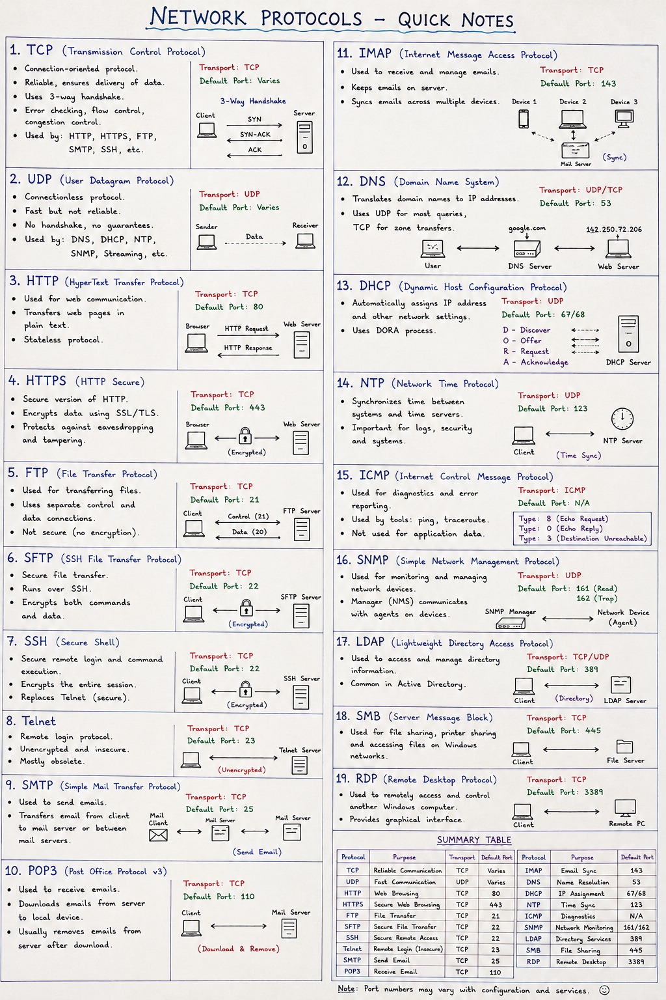

# What is a Network Protocol?

A Network Protocol is a set of rules and standards that define how devices communicate, exchange data, and interpret information over a network.

Protocols ensure reliable, secure, and standardized communication between computers, servers, and networking devices.

# Protocol Definitions
# TCP (Transmission Control Protocol)

Provides reliable, connection-oriented communication with error checking, sequencing, retransmission, and flow control.

# UDP (User Datagram Protocol)

Provides fast, connectionless communication without guaranteeing delivery or ordering of packets.

# HTTP (HyperText Transfer Protocol)

Transfers web pages and data between web browsers and web servers.
# port number
80

# HTTPS (HyperText Transfer Protocol Secure)

A secure version of HTTP that encrypts communication using TLS/SSL.
# port number
443

# FTP (File Transfer Protocol)

Transfers files between a client and a server without encryption.
# port number
21

# SFTP (SSH File Transfer Protocol)

Securely transfers files over an encrypted SSH connection.
# port number
22

# SSH (Secure Shell)

Provides secure remote login and encrypted command-line access to remote systems.
# port number
22

# Telnet

Provides remote terminal access without encryption. Mostly obsolete due to security risks.
# port number
23

# SMTP (Simple Mail Transfer Protocol)

Used to send outgoing emails between mail servers and email clients.
# port number
25

# POP3 (Post Office Protocol v3)

Downloads emails from a mail server to a local device and typically removes them from the server.
# port number
110

# IMAP (Internet Message Access Protocol)

Synchronizes emails between the mail server and multiple devices while keeping messages on the server.
# port number
143

# DNS (Domain Name System)

Translates domain names (e.g., google.com) into IP addresses.
# port number
53

# DHCP (Dynamic Host Configuration Protocol)

Automatically assigns IP addresses and other network settings to devices on a network.
# port number
67/68

# NTP (Network Time Protocol)

Synchronizes the clocks of computers and network devices with accurate time servers.
# port number
123

# ICMP (Internet Control Message Protocol)

Used for network diagnostics, error reporting, and tools such as ping and traceroute.
# port number
N/A

# SNMP (Simple Network Management Protocol)

Monitors and manages network devices such as routers, switches, and servers.
# port number
161/162

# LDAP (Lightweight Directory Access Protocol)

Provides centralized directory services for authentication and user management (commonly used with Active Directory).
# port number
389

# SMB (Server Message Block)

Enables file sharing, printer sharing, and resource access across Windows networks.
# port number
445

# RDP (Remote Desktop Protocol)

Allows users to securely access and control a remote Windows computer through a graphical interface.
# port number
3389

# Port Numbers
Well-Known Ports (0–1023)

Used by standard services and system protocols.

Registered Ports (1024–49151)

Assigned to vendor-specific applications and services.

Dynamic / Private Ports (49152–65535)

Used temporarily by client applications for outbound connections.

## Protocol Comparison

| Protocol | Purpose | Transport | Default Port |
|:---------|:--------|:---------:|:------------:|
| **TCP** | Reliable communication | TCP | Varies |
| **UDP** | Fast, connectionless communication | UDP | Varies |
| **HTTP** | Web browsing | TCP | **80** |
| **HTTPS** | Secure web browsing | TCP | **443** |
| **FTP** | File transfer | TCP | **21** |
| **SFTP** | Secure file transfer | TCP | **22** |
| **SSH** | Secure remote access | TCP | **22** |
| **Telnet** | Remote login (Unencrypted) | TCP | **23** |
| **SMTP** | Send email | TCP | **25** |
| **POP3** | Receive email | TCP | **110** |
| **IMAP** | Email synchronization | TCP | **143** |
| **DNS** | Domain name resolution | UDP / TCP | **53** |
| **DHCP** | Automatic IP address assignment | UDP | **67 / 68** |
| **NTP** | Time synchronization | UDP | **123** |
| **ICMP** | Network diagnostics and error reporting | ICMP | **N/A** |
| **SNMP** | Network monitoring and management | UDP | **161 / 162** |
| **LDAP** | Directory and authentication services | TCP / UDP | **389** |
| **SMB** | File and printer sharing | TCP | **445** |
| **RDP** | Remote Desktop access | TCP | **3389** |

## OSI Layer Mapping

| Protocol | OSI Layer |
|:---------|:---------:|
| HTTP / HTTPS | Layer 7 |
| FTP / SFTP | Layer 7 |
| SSH | Layer 7 |
| Telnet | Layer 7 |
| SMTP / POP3 / IMAP | Layer 7 |
| DNS | Layer 7 |
| DHCP | Layer 7 |
| SNMP | Layer 7 |
| LDAP | Layer 7 |
| SMB | Layer 7 |
| TCP / UDP | Layer 4 |
| ICMP | Layer 3 |
| IP | Layer 3 |

# Network Protocols
